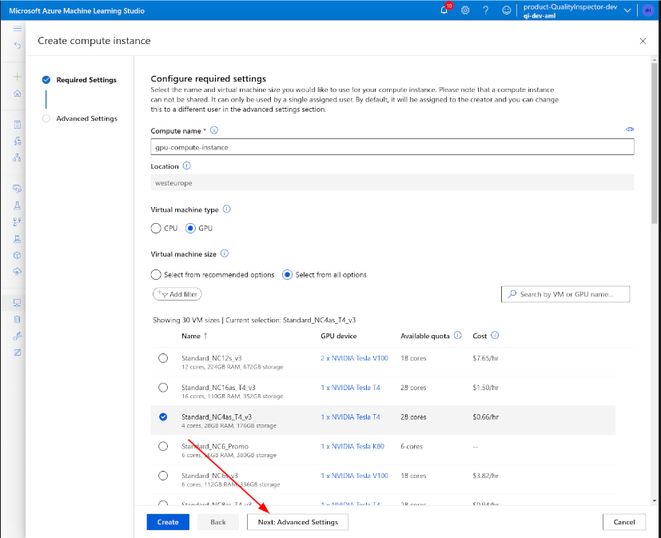
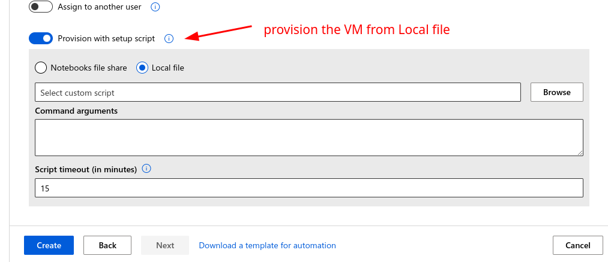
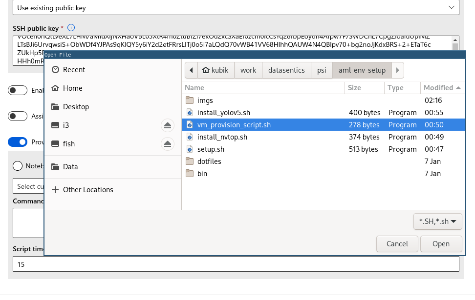
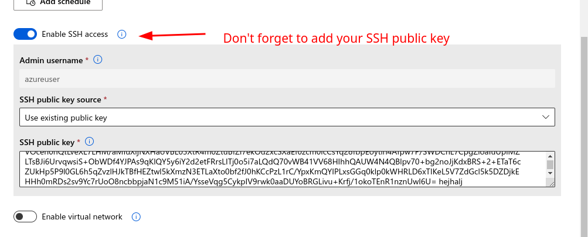

# Azure ML provision script
Few scripts that:
- setup a comfortable cmd environment on Azure ML compute instance
- installs `yolov5` into conda environment

### Installed tools
- Fish shell
- ranger
- tmux
- neovim
    - aliased to `vi`
- Fuzzy finder fzf
- fd
- nvtop

### YOLOv5 installation
- creates `yolov5` conda environment
- clones yolov5 repo to `~/yolov5`
- installs `yolov5` dependencies, `ipython` and W&B for experiment tracking


## How to setup the AML VM instance
### Option 1: SSH to the VM
#### Copy the `vm_provision_script.sh` to the VM
```bash
scp -P <port> vm_provision_script.sh azureuser@<vm-ip>:~/
```

#### Run the provision script

```bash
# first ssh to the VM
ssh azureuser@<vm-IP> -p <port>

# run the setup on the VM
./vm_provision_script.sh
```


### Option 2: Set the provision script when creating the compute instance









